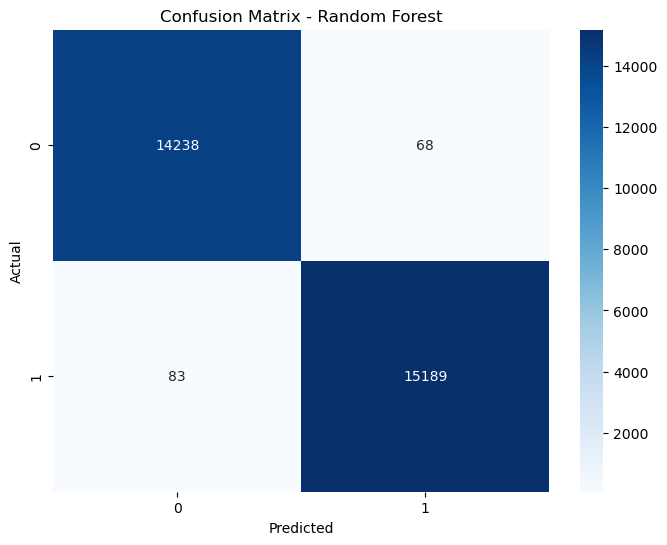

# CyberDetect 🔍

## Overview
This project implements a **Network Intrusion Detection System (NIDS)** using **Machine Learning** and **Deep Learning** models to detect network intrusions from the **NSL-KDD** dataset. The system classifies network traffic as either **Normal** or **Intrusive (Attack)** to help secure networks from potential threats.

## Dataset 📄
**NSL-KDD Dataset** is an improved version of the original KDD'99 dataset, commonly used for network intrusion detection research.

### Dataset Link:
[NSL-KDD Dataset](https://www.kaggle.com/datasets/hassan06/nslkdd)

---

## Project Pipeline ⚙️
1. **Data Loading & Cleaning**
2. **Exploratory Data Analysis (EDA)**
3. **Feature Encoding & Scaling**
4. **Feature Selection**
5. **Model Training**
6. **Model Evaluation**
7. **Visualization of Results**

---

## Models Used 🧠
| Model               | Accuracy | Precision | Recall | F1 Score |
|------------------|----------|-----------|-------|----------|
| Logistic Regression | 90.62%  | 89.15%    | 93.17% | 91.11%   |
| Decision Tree      | 99.38%  | 99.50%    | 99.29% | 99.40%   |
| Random Forest     | **99.49%** | **99.55%** | **99.45%** | **99.50%** |
| KNN Classifier    | 98.26%  | 98.41%    | 98.22% | 98.31%   |
| Deep Learning     | 95.49%  | 94.24%    | 97.21% | 95.70%   |

---

## Setup 🛠️
### Prerequisites
- Python 3.x
- TensorFlow
- Scikit-Learn
- Pandas
- Seaborn
- Matplotlib

### Installation
1. Clone the repository:
```bash
git clone https://github.com/Shrey0808/CyberDetect
cd CyberDetect
```

2. Install required libraries:
```bash
pip install -r requirements.txt
```

3. Download the NSL-KDD dataset and place it in the `data/` folder.

---

## Usage 🚀
### Running the Project
1. Execute the main Jupyter Notebook:
```bash
jupyter notebook main.ipynb
```

2. The notebook will:
   - Load and clean the data
   - Perform Exploratory Data Analysis (EDA)
   - Train and evaluate machine learning models
   - Visualize the results

### Model Selection
Modify the model dictionary in the code to select which models to train:
```python
models = {
    'Logistic Regression': LogisticRegression(),
    'Decision Tree': DecisionTreeClassifier(),
    'Random Forest': RandomForestClassifier(),
    'KNN Classifier': KNeighborsClassifier()
}
```

---

## Results 📊
| Model         | Accuracy | Precision | Recall | F1 Score |
|--------------|----------|-----------|-------|----------|
| Random Forest | **99.49%** | **99.55%** | **99.45%** | **99.50%** |



---

## Visualization 📌
- Confusion Matrices
- ROC Curves
---

## Future Improvements 🚀
- Implement **LSTM or CNN** models for sequential data
- Build a **Web App** using Flask for real-time detection
- Explainable AI with **SHAP or LIME**

---

## Folder Structure 📁
```bash
├── data/                  # Dataset files
├── main.ipynb             # Jupyter notebook
├── requirements.txt       # Required libraries
└── README.md              # Project Documentation
```

---

## Contact 📧
- Email: shreyanshsahayacer@gmail.com , hk143us@gmail.com 
- GitHub: [Shreyansh Sahay](https://github.com/Shrey0808)
          [Harsh Kumar](https://github.com/hrsh-kmr)
  
Feel free to reach out if you have any questions or suggestions!

